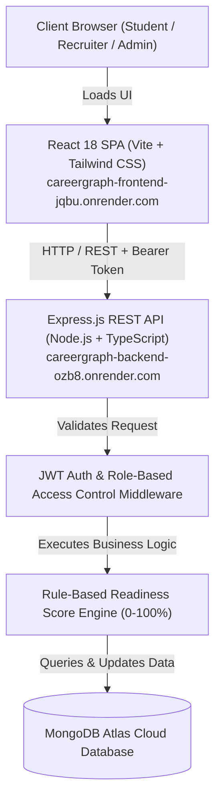

# CareerGraph 🎓📈

> **A modern, full-stack placement readiness and campus recruitment management platform engineered for engineering students, faculty mentors, recruiters, and college placement directorates.**

---

## 🚀 Live Demo

The production application is deployed and publicly accessible on Render with a managed MongoDB Atlas cloud database:

### 🔗 **[Open CareerGraph Live Application](https://careergraph-frontend-jqbu.onrender.com)**

> **Note:** The live deployment features a pre-seeded production database and a **One-Click Demo Credentials** panel on the sign-in page so recruiters, hiring managers, and evaluators can instantly test all user roles without manual registration.
>
> **Live Backend API Health:** [`https://careergraph-backend-ozb8.onrender.com/api/health`](https://careergraph-backend-ozb8.onrender.com/api/health)

---

## 📌 Overview

Collegiate placement ecosystems frequently suffer from fragmented tooling: students track their DSA practice on spreadsheets, log job applications across disparate portals, and lack clear visibility into their hiring readiness. Simultaneously, campus placement officers struggle with unstandardized student profiles and manual tracking of company recruitment drives.

**CareerGraph** unifies the entire engineering placement lifecycle into a single, cohesive platform. It bridges the gap between campus candidates and placement directorates with:

- **Objective Readiness Evaluation**: An explainable, rule-based Career Readiness Score (0–100%) that measures real engineering competencies instead of subjective self-assessments.
- **Systematic Preparation Frameworks**: Dedicated, granular trackers for Data Structures & Algorithms (DSA) across 12 CS domains and 10 core interview syllabus modules.
- **End-to-End Placement Pipeline**: Real-time opportunity board with criteria filtering, stage-by-stage application progression, and cohort recruitment telemetry.
- **Multi-Stakeholder Collaboration**: Role-tailored workflows for Students, Placement Administrators, Faculty Mentors, Campus Recruiters, and Alumni.

---

## ✨ Key Features

### 🎯 Transparent Career Readiness Engine
- **Explainable 0–100% Score**: Computed via a deterministic multi-factor scoring model across 5 core pillars:
  - **Profile Completeness (15%)**: Contact details, degree, resume URL, GitHub, and LinkedIn.
  - **Technical Skills Matrix (20%)**: Quantity, domain diversity, and advanced/expert depth.
  - **DSA Problem Solving (25%)**: Solved volume (benchmark 150+), medium/hard ratio, and topic coverage.
  - **Core CS & Interview Prep (25%)**: Completion percentage across 10 interview disciplines.
  - **Application Pipeline Velocity (15%)**: Active drives, assessment clearances, and shortlist milestones.
- **Readiness Tier Classification**: Real-time assignment to *Beginning* (<40%), *Developing* (40–59%), *Competitive* (60–79%), or *Placement Ready* (80–100%).
- **Automated Recommendations**: Dynamic, personalized tips advising students on their next highest-impact preparation milestone.

### 💻 Data Structures & Algorithms (DSA) Tracker
- **12 Foundational CS Topics**: Arrays, Strings, Linked Lists, Stacks, Queues, Hashing, Recursion, Sorting, Searching, Trees, Graphs, and Dynamic Programming.
- **Granular Difficulty Breakdown**: Dedicated counters for Easy, Medium, and Hard solved questions with custom revision notes per topic.
- **Progress Telemetry**: Live completion percentages against recommended interview problem benchmarks.

### 📚 Structured Interview Preparation
- **10 Core Preparation Modules**: Interactive syllabus checklists covering:
  - Data Structures & Algorithms
  - Object-Oriented Programming (OOP)
  - Database Management Systems (DBMS)
  - Operating Systems (OS)
  - Computer Networks (CN)
  - SQL & Query Optimization
  - Quantitative & Logical Aptitude
  - Standard HR Interview Questions
  - STAR Framework Behavioral Scenarios
  - Mock Technical Interview Exercises
- **Actionable Tracking**: Toggleable topic checklists with instant progress percentage recalculation.

### 🛠️ Technical Skills Inventory
- **Domain Categorization**: Skills organized across Programming Languages, Frontend, Backend, Databases, CS Fundamentals, and DevOps/Tools.
- **Proficiency Levels**: Beginner, Intermediate, Advanced, and Expert ratings with visual tags.
- **Student Profile Dossier**: Comprehensive summary highlighting technical strengths for recruiter evaluation.

### 💼 Campus Placement Drives & Application Pipeline
- **Recruitment Board**: Searchable campus drives with filtering by job type (*Full-time*, *Internship*, *Intern + PPO*), compensation package (CTC in LPA), location, and application deadlines.
- **Stage-by-Stage Tracking**: Real-time pipeline progression (*Saved* → *Applied* → *Assessment* → *Interview* → *Shortlisted* → *Selected* → *Rejected*).
- **Application Logs**: Centralized record of assessment scores, interview dates, and personal candidate notes.

### 📊 Placement Directorate & Admin Telemetry
- **Directorate Dashboard**: Real-time cohort metrics displaying total student enrollment, active drives, total applications, placement conversion rate, and average DSA problem volume.
- **Recruitment Funnel Analytics**: Interactive visual charts (powered by Recharts) showing stage conversions from initial application to final offer.
- **Skill Supply vs. Market Demand**: Batch-wide skill distribution comparisons against open drive prerequisites.
- **Student Candidate Directory**: Filterable directory with live readiness score badges, profile dossiers, and detailed preparation inspection.
- **Placement Drive Management**: Full administrative CRUD suite to publish, update, and manage campus drives with custom eligibility criteria.
- **Master Skills Catalog**: Controlled taxonomy management to add, update, or remove verified platform skills.

---

## 👥 User Roles & Access Control

CareerGraph enforces strict Role-Based Access Control (RBAC) across 5 distinct personas:

| Role | Access & Key Responsibilities |
| :--- | :--- |
| **Student (`student`)** | Access to personal readiness score, DSA tracker, interview checklists, skills inventory, campus job board, and active application pipeline. |
| **Placement Admin (`admin`)** | Full oversight of the placement ecosystem: create/manage drives, review cohort student dossiers, update candidate application stages, manage the master skills catalog, and inspect recruitment analytics. |
| **Faculty Mentor (`lecturer`)** | Academic view to inspect departmental student directories, analyze cohort preparation metrics, and identify curriculum skill gaps against industry requirements. |
| **Campus Recruiter (`industry`)** | Dedicated corporate view to post placement drives, inspect student applicants, evaluate candidate readiness, and track candidate interview progression. |
| **Alumni Mentor (`alumni`)** | Access to student preparation resources and student directory to provide mentorship, mock interview guidance, and referrals. |

---

## 🛠️ Tech Stack

### Frontend
- **Framework:** React 18 (TypeScript)
- **Build Tool:** Vite 6
- **Routing:** React Router v6
- **Styling:** Tailwind CSS v3.4, PostCSS, Autoprefixer
- **Visualizations & Charts:** Recharts
- **Iconography:** Lucide React
- **HTTP Client:** Axios (with Bearer token interceptors)

### Backend
- **Runtime:** Node.js (v18+)
- **Framework:** Express.js 4
- **Language:** TypeScript 5
- **Database ODM:** Mongoose 8
- **Validation:** Express-Validator
- **Development Server:** ts-node-dev (with live reloading)

### Database
- **Production:** MongoDB Atlas (Cloud-hosted, TLS-encrypted connection)
- **Local / Offline Fallback:** Embedded in-memory MongoDB (`mongodb-memory-server`) automatically initializes if no local or remote MongoDB instance is detected during development.

### Authentication & Security
- **Token Auth:** Stateless JSON Web Tokens (`jsonwebtoken`)
- **Password Protection:** `bcryptjs` hashing with 10 salt rounds
- **Authorization:** Route-level RBAC middleware (`protect` & `authorize`)
- **CORS:** Origin whitelisting with credential handling
- **Sanitization:** Centralized error handling preventing internal stack or database leaks

### Deployment & DevOps
- **Frontend Hosting:** Render Static Site (with single-page application URL rewrites)
- **Backend Hosting:** Render Web Service (Node.js runtime with health checks)
- **Infrastructure Blueprint:** Declarative `render.yaml` infrastructure-as-code
- **Version Control:** Git & GitHub Monorepo

---

## 🏗️ Architecture

```
                                  ┌────────────────────────┐
                                  │   Client Web Browser   │
                                  │ (Recruiters, Students) │
                                  └───────────┬────────────┘
                                              │
                                              │ HTTPS / JSON
                                              ▼
                    ┌──────────────────────────────────────────────────┐
                    │            Render Static Hosting                 │
                    │   React 18 SPA + Vite + Tailwind CSS + Recharts   │
                    └─────────────────────────┬────────────────────────┘
                                              │
                                              │ REST API (Axios + JWT Bearer)
                                              ▼
                    ┌──────────────────────────────────────────────────┐
                    │            Render Web Service (Node/Express)     │
                    │  ┌────────────────────────────────────────────┐  │
                    │  │ Middleware: CORS, JWT Auth, RBAC, Validator│  │
                    │  └─────────────────────┬──────────────────────┘  │
                    │                        ▼                         │
                    │  ┌────────────────────────────────────────────┐  │
                    │  │ Controllers & Readiness Calculation Engine │  │
                    │  └─────────────────────┬──────────────────────┘  │
                    │                        ▼                         │
                    │  ┌────────────────────────────────────────────┐  │
                    │  │ Mongoose ODM Schemas & Models              │  │
                    │  └────────────────────────────────────────────┘  │
                    └─────────────────────────┬────────────────────────┘
                                              │
                                              │ Mongoose TLS Protocol
                                              ▼
                    ┌──────────────────────────────────────────────────┐
                    │               MongoDB Atlas Cloud                │
                    │    (Users, Skills, Drives, Applications, etc.)   │
                    └──────────────────────────────────────────────────┘
```



---

## 📂 Project Structure

```
CareerGraph/
├── package.json               # Root monorepo orchestrator (concurrent dev, build, seed)
├── render.yaml                # Declarative Render infrastructure-as-code blueprint
├── .env.example               # Template environment configuration
├── README.md                  # Project documentation
├── backend/
│   ├── package.json           # Backend dependencies & build scripts
│   ├── tsconfig.json          # TypeScript compiler configuration
│   └── src/
│       ├── config/            # MongoDB Atlas connection & environment parsing
│       ├── controllers/       # Route handlers (auth, users, skills, drives, apps, admin)
│       ├── middleware/        # JWT verification, RBAC authorization, validation & error handler
│       ├── models/            # Mongoose schemas (User, Skill, StudentSkill, Opportunity, Application, etc.)
│       ├── routes/            # Modular Express router endpoints (/api/*)
│       ├── services/          # Transparent Rule-Based Career Readiness Engine
│       ├── utils/             # Database seed scripts & pre-populated mock dataset
│       ├── app.ts             # Express application initialization, CORS & route binding
│       └── server.ts          # Server bootstrap & port listener
└── frontend/
    ├── package.json           # Frontend dependencies & build scripts
    ├── vite.config.ts         # Vite bundler configuration & local API proxying
    ├── tailwind.config.js     # Tailwind CSS theme configuration
    ├── index.html             # HTML entry point
    └── src/
        ├── assets/            # Static assets & SVG icons
        ├── components/        # Reusable UI widgets (ReadinessGauge, StatCard, Badge, Modal, Navbar, Sidebar)
        ├── context/           # AuthContext (JWT persistence, user state, session handling)
        ├── pages/
        │   ├── public/        # LandingPage, LoginPage, RegisterPage
        │   ├── student/       # Dashboard, Profile, Skills, DSA Tracker, Interview Prep, Drives, Applications
        │   └── admin/         # Directorate Dashboard, ManageStudents, ManageOpportunities, ManageApplications, Analytics
        ├── services/          # Typed Axios REST API client
        ├── types/             # Shared TypeScript models and interfaces
        ├── App.tsx            # Protected client-side routing & role guards
        └── main.tsx           # React DOM root entry
```

---

## 🔐 Authentication & Security

- **Salted Password Hashing:** User passwords are encrypted with `bcryptjs` using 10 salt rounds and excluded from Mongoose query projections by default (`select: false`).
- **Stateless Bearer Tokens:** Authentication utilizes JSON Web Tokens (`JWT`) carrying user ID and role claims, attached via Axios request interceptors as `Authorization: Bearer <token>`.
- **Dual-Layer Route Protection:**
  - *Backend:* Middleware (`protect`) validates token signatures, and `authorize(...roles)` enforces endpoint permissions.
  - *Frontend:* Client-side `<ProtectedRoute allowedRoles={[...]}>` components prevent unauthorized page views and redirect unauthenticated users to `/login`.
- **Input Validation:** Incoming request bodies are validated using `express-validator` rules before reaching controller business logic.
- **Origin-Whitelisted CORS:** Backend restricts CORS to authorized Render production domains, Vercel domains, and local development origins.
- **Zero Committed Secrets:** All sensitive credentials, database connection strings, and JWT keys are isolated in environment variables.

---

## 🧪 Demo Accounts

The project includes pre-seeded demonstration accounts tailored for immediate evaluation:

| Role | Email | Demo Password | Persona & Scope |
| :--- | :--- | :--- | :--- |
| **Placement Admin** | `admin@careergraph.dev` | `Admin@123456` | Placement Directorate Head • Full admin access |
| **Student (Placement Ready)** | `rahul.sharma@college.edu` | `Student@123456` | Final year CS • **82% Readiness** • 165 DSA Solved • 4 Applications |
| **Student (Competitive)** | `priya.patel@college.edu` | `Student@123456` | IT Major • **58% Readiness** • Full Stack • 3 Applications |
| **Student (Developing)** | `amit.verma@college.edu` | `Student@123456` | ECE Major • **28% Readiness** • Beginner DSA • 1 Application |
| **Faculty Mentor** | `faculty@college.edu` | `Faculty@123456` | Associate Professor • Departmental student readiness review |
| **Campus Recruiter** | `recruiter@techcorp.com` | `Industry@123456` | TechCorp Talent Acquisition • Drive creation & applicant tracking |
| **Alumni Mentor** | `alumni@college.edu` | `Alumni@123456` | Microsoft SDE-2 • Mentorship and student directory access |

> 💡 **Quick Sign-In:** On the [Sign In Page](https://careergraph-frontend-jqbu.onrender.com/login), click any button under **"Quick One-Click Demo Credentials"** to populate and submit credentials automatically.

---

## 🖥️ Live Application & Exploration

Rather than relying on static screenshots, recruiters and evaluators can explore the live, fully interactive deployed application:

👉 **[Launch CareerGraph Live Application](https://careergraph-frontend-jqbu.onrender.com)**

### Recommended Exploration Paths:
1. **As a Student:** Log in with `rahul.sharma@college.edu` → Inspect the **82% Readiness Gauge** → Explore the **DSA Tracker** with 12 algorithmic topics → View the **Interview Prep** checklist → Check the **Applications** pipeline.
2. **As an Admin:** Log in with `admin@careergraph.dev` → Explore the **Directorate Dashboard** metrics → Review the **Student Directory** with live readiness scores → View **Recruitment Analytics & Funnel Charts** → Manage **Campus Placement Drives**.
3. **As a Recruiter:** Log in with `recruiter@techcorp.com` → Browse the campus drives and inspect student applications.

---

## ⚙️ Installation & Local Development

### Prerequisites
- **Node.js:** v18.0.0 or higher (`node -v`)
- **npm:** v9.0.0 or higher (`npm -v`)
- *(Optional)* **MongoDB:** A local MongoDB instance or MongoDB Atlas URI. *(If no MongoDB instance is running locally, CareerGraph automatically falls back to an embedded in-memory MongoDB in development mode!)*

### 1. Clone the Repository
```bash
git clone https://github.com/Saiteja-1605/CareerGraph.git
cd CareerGraph
```

### 2. Install Dependencies
Install root, backend, and frontend packages simultaneously:
```bash
npm run install:all
```

### 3. Configure Environment Variables
Copy the example environment configuration into the backend directory:
```bash
# Windows PowerShell
Copy-Item .env.example backend/.env

# Linux / macOS
cp .env.example backend/.env
```

### 4. Seed Demonstration Data
Populate your local database with demo accounts, the master skills catalog, 8 campus recruitment postings, and student application histories:
```bash
npm run seed
```

### 5. Start Development Servers
Run both backend and frontend concurrently with a single command:
```bash
npm run dev
```

- **Frontend Client:** `http://localhost:5173`
- **Backend REST API:** `http://localhost:5000`
- **Health Check:** `http://localhost:5000/api/health`

*(Note: The Vite frontend development server includes an automated proxy for `/api` pointing directly to `http://localhost:5000`)*

---

## 🌐 Deployment Architecture

CareerGraph is architected for seamless cloud deployment on **Render** using the included `render.yaml` specification:

```yaml
services:
  # Backend REST API Web Service
  - type: web
    name: careergraph-backend
    runtime: node
    plan: free
    buildCommand: npm run install:all && npm run build
    startCommand: cd backend && npm start
    healthCheckPath: /api/health

  # Frontend Single-Page Static Site
  - type: web
    name: careergraph-frontend
    runtime: static
    buildCommand: cd frontend && npm install --include=dev && npm run build
    staticPublishPath: frontend/dist
    routes:
      - type: rewrite
        source: /*
        destination: /index.html
```

- **Frontend (Static Site):** `https://careergraph-frontend-jqbu.onrender.com`
- **Backend (Web Service):** `https://careergraph-backend-ozb8.onrender.com`
- **Database:** MongoDB Atlas M0 cluster connected over TLS.

---

## 🔑 Environment Variables

### Backend Configuration (`backend/.env`)

| Variable | Description | Example / Default |
| :--- | :--- | :--- |
| `PORT` | Server listening port | `5000` |
| `NODE_ENV` | Runtime environment mode | `development` or `production` |
| `MONGO_URI` | MongoDB connection string (Local or MongoDB Atlas) | `mongodb://127.0.0.1:27017/careergraph` |
| `JWT_SECRET` | Secret key used to sign and verify JWT auth tokens | `your_secure_jwt_secret_key` |
| `JWT_EXPIRES_IN`| Lifespan of generated JWT tokens | `7d` |
| `CLIENT_URL` | Allowed frontend origin for CORS policies | `http://localhost:5173` |

### Frontend Configuration (`frontend/.env`)

| Variable | Description | Example / Default |
| :--- | :--- | :--- |
| `VITE_API_URL` | Target backend REST API URL | `http://localhost:5000/api` (Local) / Render Backend URL (Prod) |

*(Note: In local development, leaving `VITE_API_URL` empty defaults to Vite's local `/api` proxy)*

---

## 🧪 Testing & Build Verification

- **Production Build Validation:**
  ```bash
  npm run build
  ```
  Runs `rimraf dist && tsc` on the backend and `tsc && vite build` on the frontend. Both compile cleanly with zero TypeScript errors.
- **REST API Health Check:**
  ```bash
  curl -I https://careergraph-backend-ozb8.onrender.com/api/health
  # HTTP/1.1 200 OK
  ```

---

## 📈 Future Improvements

- **AI Resume ATS Compatibility Scanner:** Semantic matching between student resumes and placement job descriptions.
- **Automated Deadline Notifications:** Email and web-push alerts for upcoming placement drive deadlines and interview schedules.
- **Coding Platform Synchronization:** Direct OAuth integration with LeetCode, Codeforces, and GitHub profiles to sync solved question counts automatically.
- **Peer-to-Peer Mock Interviews:** Built-in video and collaborative code editor for student peer interview practice.

---

## 👨‍💻 Author

**Saiteja**
- GitHub: [@Saiteja-1605](https://github.com/Saiteja-1605)
- Project Repository: [Saiteja-1605/CareerGraph](https://github.com/Saiteja-1605/CareerGraph)

---

## 📄 License

This project is licensed under the [MIT License](https://opensource.org/licenses/MIT).
